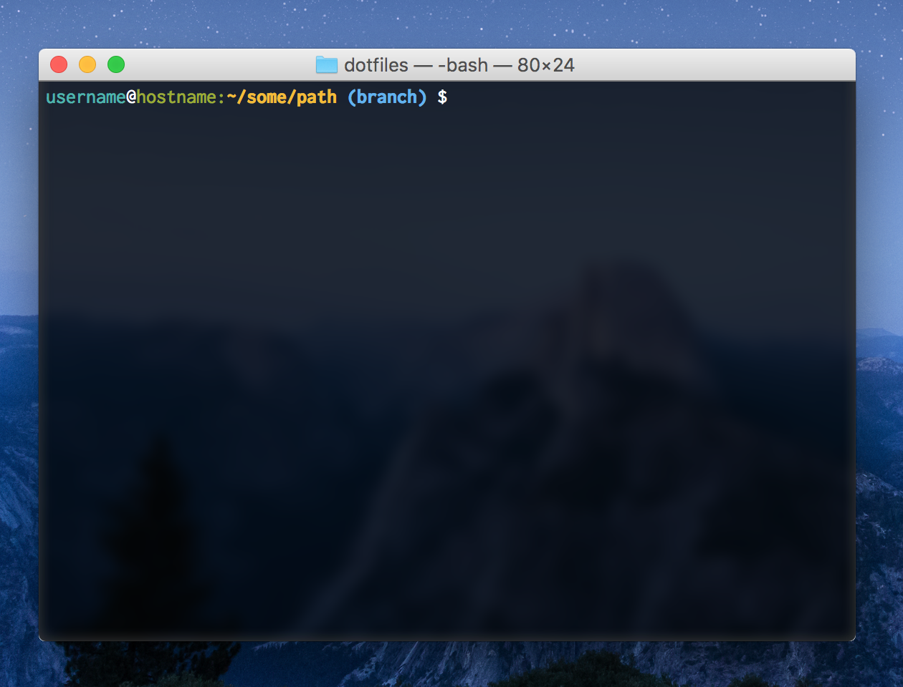

# dotfiles
My dotfiles.

### macOS Terminal Theme - Clean

To install first add the Inconsolata font by opening the `Inconsolata-Bold.ttf` and `Inconsolata-Regular.ttf` files with apple font manager this will allow you to install the fonts.  After the fonts are installed go ahead and open the `Clean.terminal` file by double clicking on it.  This will install the theme, and then you can open terminal preferences and make it your default theme.

### Terminal Prompt
Add the fallowing to your `bashrc` or `.bash_profile` found in the home dir.

```bash
# git branch parser
parse_git_branch() {
    git branch 2> /dev/null | sed -e '/^[^*]/d' -e 's/* \(.*\)/ (\1)/'
}

# terminal prompt
export PS1="\[\033[36m\]\u\[\033[39m\]@\[\033[32m\]\h:\[\033[39m\]\[\033[1m\]\[\033[32m\]\w\[\033[39m\]\[\033[22m\]\[\033[1m\]\[\033[34m\]\$(parse_git_branch)\[\033[39m\]\[\033[22m\] $ "

```
